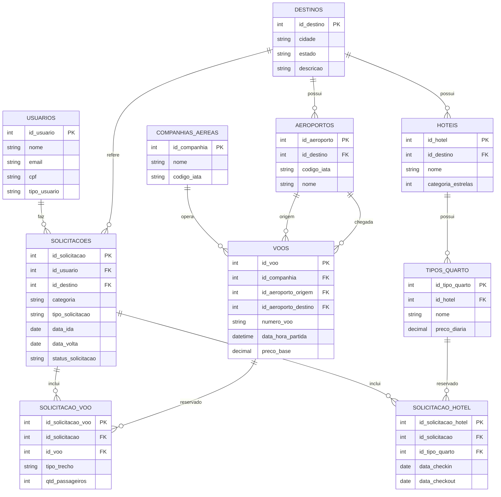

# Brasil Travel

Sistema de reservas de viagens (voos e hotéis) com banco de dados relacional normalizado.

## Sobre a aplicação

O sistema simula uma agência de viagens online, onde o usuário escolhe um destino, seleciona um voo (por companhia aérea) e um hotel (por tipo de quarto), e monta uma solicitação de orçamento ou reserva. Administradores acompanham e tratam essas solicitações.

## Modelo conceitual

7 entidades e 3 tabelas associativas, girando em torno da solicitação de viagem (voo + hotel).

